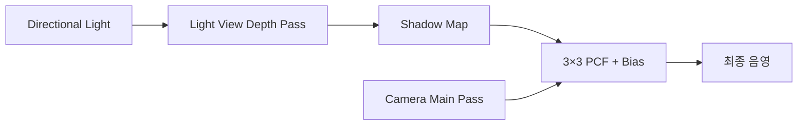
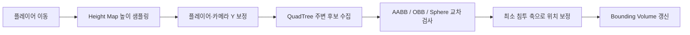
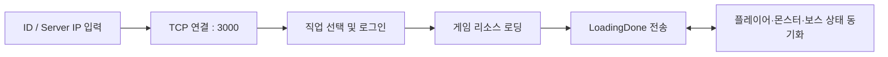

# Monster Breakers Client

> DirectX 12 기반 3D 멀티플레이 액션 RPG 클라이언트입니다. 기사, 마법사, 도적 중 하나를 선택해 필드를 탐험하고, 몬스터와 보스를 상대하며 다른 플레이어와 게임 상태를 실시간으로 동기화합니다.

## 기술 스택

| 구분 | 사용 기술 및 도구 |
|---|---|
| Language |   |
| Graphics & Game |    |
| Network |    |
| Audio |  |
| Tools |       |

## 팀원

| 이름 | GitHub | 맡은 분야 |
|---|---|---|
| 김경민 | [kimgyeongmin5348](https://github.com/kimgyeongmin5348) | IOCP 서버, 패킷 설계, 플레이어·몬스터·보스 상태 동기화, NPC 및 미션 연동 |
| 구민상 | [808Jade](https://github.com/808Jade) | 지형·맵 시스템, 맵 충돌 처리, GPU 인스턴싱, 사운드 시스템 및 카메라 |
| 박아연 | [aecong](https://github.com/aecong) | 클라이언트 렌더링, 애니메이션, Shadow Map, 파티클·이펙트, UI 및 전투 시스템 |

## 시연 영상

[](https://www.youtube.com/watch?v=ydrw-ov5ouY)

**[2026 한국공학대학교 게임공학과 졸업작품 — Monster Breakers 전체 영상 보기](https://www.youtube.com/watch?v=ydrw-ov5ouY)**

4분 43초 동안 로그인과 직업 선택, 필드 전투, 직업별 스킬, 보스전 및 충돌 디버그 기능을 확인할 수 있습니다.

## 중점 연구 분야

### 1. 트랙 기반 애니메이션 블렌딩

단일 애니메이션을 즉시 교체하면 대기·이동·공격 상태가 바뀌는 순간 포즈가 튀는 문제가 있었습니다. 이를 해결하기 위해 스켈레톤 전체에 적용되는 애니메이션 트랙의 재생 속도와 가중치를 제어하고, 두 트랙을 일정 시간 함께 재생하는 크로스페이드를 구현했습니다.

```text
상태 변경 감지
   → PlayAnimationTrack(track, speed)
   → StartAnimationBlend(from, to, 0.3s)
   → from weight: 1.0 ─────▶ 0.0
   →   to weight: 0.0 ─────▶ 1.0
   → 전환 완료 후 이전 트랙 비활성화
```

- `SetTrackSpeed()`로 이동·공격·스킬 트랙별 재생 속도 조절
- `SetTrackWeight()`로 이전 트랙과 다음 트랙의 스켈레톤 포즈를 선형 보간
- 블렌딩 도중 다시 상태가 바뀌어도 현재 가중치를 시작점으로 사용해 연속성 유지
- 전환이 끝나면 대상 트랙만 활성화하고 이전 트랙의 위치와 가중치를 초기화
- `Caps Lock`으로 블렌딩을 켜고 끌 수 있어 즉시 전환과 크로스페이드 결과를 같은 장면에서 비교 가능

| 구분 | 즉시 전환 | 크로스페이드 적용 |
|---|---|---|
| 상태 변경 | 기존 트랙을 끄고 다음 트랙을 바로 적용 | 두 트랙을 동시에 활성화한 뒤 가중치 보간 |
| 시각적 결과 | 전환 프레임에서 포즈가 급격히 바뀜 | 대기·이동·공격 자세가 자연스럽게 연결됨 |
| 중간 재전환 | 새 포즈로 다시 스냅될 수 있음 | 진행 중인 가중치에서 다음 전환을 이어감 |

### 2. Shadow Map 품질 개선

라이트 시점에서 장면의 깊이를 Shadow Map에 기록하는 **Depth Pass**와, 해당 텍스처를 샘플링해 가시성을 판정하는 **Main Pass**를 분리했습니다. 정적 메시와 스키닝 메시에는 각각 전용 Shadow PSO를 적용하고, Main Pass에서는 3×3 PCF 샘플링으로 그림자 경계를 완화합니다.



#### 캐릭터 그림자 개선 전후

| 개선 전 | 개선 후 |
|---|---|
| 직교 투영 범위가 약 `800`으로 넓어 캐릭터에 배정되는 텍셀이 부족하고 윤곽이 뭉개짐 | 투영 범위를 `60 × 60`으로 축소해 동일 해상도에서 캐릭터 주변의 텍셀 밀도 향상 |
| `RenderShadow()`가 서브메시 0번만 그려 장비나 신체 일부의 그림자가 누락됨 | `GetSubMeshCount()`를 기준으로 모든 서브메시를 순회 렌더링 |
| 깊이 정밀도 오차로 표면 줄무늬와 분리된 그림자가 발생 | Rasterizer depth bias와 셰이더 비교 bias를 함께 조절해 acne와 Peter Panning 사이의 균형 확보 |

현재 설정은 `2048 × 2048` Shadow Map, `60 × 60` 직교 투영, Rasterizer `DepthBias=1000`, `SlopeScaledDepthBias=1.0`, 비교 bias `0.0025`를 사용합니다. `Tab` 키로 같은 카메라 구도에서 그림자를 켜고 끌 수 있어 적용 결과를 바로 확인할 수 있습니다.

> 비교 자료를 촬영할 때는 동일한 캐릭터·카메라·라이트 구도를 유지한 뒤, 개선 전 커밋과 현재 버전을 나란히 배치하면 투영 범위와 서브메시 수정 효과를 가장 명확하게 보여줄 수 있습니다.

### 3. 월드 스페이스 파티클 시스템

HP 바와 상호작용 프롬프트에 사용하던 월드 스페이스 빌보드 정점 셰이더를 데미지 숫자에도 재사용했습니다. 카메라 View 행렬에서 Right/Up 벡터를 구해 월드 좌표의 쿼드를 항상 카메라 방향으로 정렬하므로, 별도의 데미지 숫자용 정점 셰이더 없이 동일한 렌더링 경로를 공유합니다.

- 충돌 판정에서 타격이 확정되는 순간 명중 위치에 `Spawn()`
- 숫자 메시를 위로 이동시키고 수명 후반부에 Alpha를 줄여 페이드아웃
- 일반 피해는 흰색, 치명타는 주황색으로 구분
- 활성 객체를 최대 `128`개로 제한하고, 초과 시 가장 오래된 객체부터 제거
- 모든 인스턴스가 공유하는 셰이더에 시스템 소유의 `AddRef()`를 유지
- 활성 숫자가 0개가 될 때 마지막 Material의 `Release()`로 공용 셰이더까지 소멸하던 크래시 수정

> 현재 구현은 활성 목록의 개수 제한과 수명 관리를 적용했으며, 객체 자체는 생성·삭제합니다. 빈 객체를 재사용하는 고정 크기 오브젝트 풀은 후속 최적화 대상으로 남겨두었습니다.

### 4. 지형·플레이어·맵 오브젝트 충돌 처리

넓은 높이맵 위에서 플레이어가 지형 아래로 내려가거나 카메라가 땅을 관통하지 않도록 지형 높이 보정을 적용했습니다. 맵에 배치된 건물과 소품은 형태에 따라 AABB, OBB, Sphere 충돌체를 생성하고, 충돌 시 겹침이 가장 작은 방향으로 플레이어를 밀어내 자연스럽게 벽과 사물을 따라 이동할 수 있도록 처리합니다.



#### 지형 충돌

- 플레이어의 월드 좌표를 Terrain 로컬 좌표로 변환한 뒤 `GetHeight(x, z)`로 높이 샘플링
- Height Map을 구성하는 삼각형 방향에 맞춰 `bReverseQuad`를 계산해 보간 오차 감소
- 플레이어 발 위치가 지면 아래로 내려가면 Y 위치를 지형 높이로 올리고 수직 속도를 0으로 초기화
- 3인칭 카메라에도 같은 높이 검사를 적용해 지형 아래로 파고드는 현상 방지

#### 맵 오브젝트 충돌

| 충돌체 | 적용 대상 | 해결 방식 |
|---|---|---|
| AABB | 일반 건물 및 직교형 소품 | X/Z축 겹침량을 비교하고 더 작은 축 방향으로 밀어냄 |
| OBB | 회전된 집, 울타리, 바위, 카트 등의 소품 | 플레이어를 OBB 로컬 공간으로 변환하고 표면의 최근접점을 구해 바깥으로 보정 |
| Sphere | 우물, 화분처럼 원형에 가까운 오브젝트 | 두 중심 사이 거리와 안전 반지름을 이용해 방사 방향으로 밀어냄 |

맵 인스턴스의 로컬 Bounding Box는 각 인스턴스의 World Matrix로 변환해 월드 충돌체로 캐싱합니다. 장식용 풀, 모래, 길과 작은 소품은 충돌 대상에서 제외해 불필요한 검사와 이동 방해를 줄였습니다. 서버 스폰 직후에는 짧은 충돌 유예 시간을 두어 동기화된 시작 위치가 환경 충돌에 의해 즉시 밀려나는 문제도 방지합니다.

### 5. 대량 맵 오브젝트 렌더링 최적화

맵에는 나무, 울타리, 돌, 상점 소품처럼 같은 메시를 공유하는 사물이 반복해서 배치됩니다. 각 사물을 개별 `CGameObject`와 Draw Call로 렌더링하면 오브젝트 수에 비례해 CPU 렌더링 부하가 증가하므로, 동일 모델을 그룹화한 **GPU Instancing**을 적용했습니다.

```text
맵 배치 파일 로드
   → modelIndex 기준으로 동일 메시 그룹화
   → 인스턴스별 World Matrix 생성
   → GPU Default Heap의 Instance Buffer에 일괄 업로드
   → 모델 그룹마다 RenderInstanced() 1회 호출
```

- 정점·인덱스·재질은 같은 모델끼리 공유하고 인스턴스별 World Matrix만 별도 버퍼로 전달
- `INSTANCE_TRANSFORM` 입력을 받는 `VSInstancedStandard`에서 각 인스턴스의 위치·회전·크기 적용
- 개별 오브젝트 수가 아니라 **서로 다른 모델 그룹 수**를 기준으로 Draw Call 생성
- 정적인 인스턴스 데이터와 충돌체를 로딩 시 미리 생성해 매 프레임 행렬 계산과 Bounding Box 재구성 방지
- GPU 전용 Default Heap에 인스턴스 버퍼를 유지하고 초기 업로드 버퍼는 로딩 완료 후 해제

렌더링뿐 아니라 충돌 Broad Phase에도 QuadTree를 사용합니다. 플레이어 Bounding Box와 겹치는 노드만 재귀적으로 방문해 주변 동적 오브젝트와 정적 Collider 후보를 수집하므로, 맵 전체 사물과 매 프레임 충돌 검사를 수행하지 않습니다.

| 방식 | 개별 렌더링 | 현재 구현 |
|---|---|---|
| Draw Call 기준 | 배치된 사물 개수 | 동일 모델 그룹 개수 |
| 인스턴스 데이터 | 객체마다 렌더 상태 설정 | World Matrix를 GPU 버퍼에 일괄 전달 |
| 충돌 후보 | 전체 사물 전수 검사 | QuadTree의 플레이어 인접 노드만 검사 |
| 정적 데이터 | 프레임마다 갱신 가능성 | 로딩 시 버퍼와 월드 충돌체를 미리 생성 |

`O` 디버그 오버레이에서 `FPS`, `Map Objects`, `Draw Calls`, `QuadTree Nodes`를 함께 확인할 수 있습니다. `M` 키는 기본 배치와 대량 오브젝트 테스트 배치를 전환해, 오브젝트 수가 증가해도 인스턴싱으로 Draw Call 증가가 억제되는지 비교하기 위한 기능입니다.

### 연구 결과 요약

| 분야 | 문제 | 핵심 해결 | 검증 방법 |
|---|---|---|---|
| 애니메이션 | 상태 전환 순간 포즈 스냅 | 두 트랙 가중치 크로스페이드 | `Caps Lock` 전후 비교 |
| 그림자 | 낮은 텍셀 밀도와 일부 서브메시 누락 | 투영 범위 축소, 전체 서브메시 Depth 렌더링, bias 튜닝 | `Tab` 전환 및 동일 구도 캡처 |
| 파티클 | 반복 UI 효과와 공용 리소스 수명 오류 | 빌보드 VS 재사용, 수명/상한 관리, 시스템 단위 참조 유지 | 연속 타격 후 0개→재스폰 안정성 확인 |
| 충돌 | 지형·카메라 관통과 복잡한 맵 사물 충돌 | Height Map 보정, 형태별 Bounding Volume, 최소 침투 방향 보정 | `O` 충돌체 시각화 및 경계 이동 테스트 |
| 최적화 | 반복 사물 증가에 따른 Draw Call과 충돌 검사 증가 | GPU Instancing, 정적 데이터 캐싱, QuadTree Broad Phase | `M` 대량 배치 전환 후 FPS·Draw Call 비교 |

## 주요 기능

- DirectX 12 기반 3D 렌더링과 HLSL 셰이더
- 지형, 스카이박스, 캐릭터 및 몬스터 애니메이션
- 기사·마법사·도적의 기본 공격과 직업별 스킬
- 파티 플레이어, 몬스터, 보스의 위치·상태·피격 동기화
- 충돌 처리, 3인칭 카메라, 그림자 및 파티클 이펙트
- NPC 상호작용, 미션, 골드 보상과 스킬 강화
- FMOD 기반 배경음악과 효과음

## 빠른 실행

1. [IOCP 서버](https://github.com/kimgyeongmin5348/Monster_Breakers_IOCP)를 먼저 실행합니다.
2. `실행파일/Client.exe`를 실행합니다.
3. 플레이어 ID를 입력하고 `Enter`를 누릅니다.
4. 서버 IPv4 주소를 입력하고 `Enter`를 누릅니다.
   - 같은 PC에서 서버를 실행했다면 `127.0.0.1`을 입력합니다.
   - 클라이언트는 TCP `3000` 포트로 접속합니다.
5. 화면의 왼쪽부터 기사, 마법사, 도적 중 하나를 클릭해 게임을 시작합니다.

> 실행 시 `Client.exe`, FMOD DLL, 셰이더, `Model`, `Image`, `Sound`, `Terrain`, `Skybox` 폴더가 같은 실행 디렉터리 구조에 있어야 합니다. 배포본은 `실행파일` 폴더의 구성을 그대로 유지해 주세요.

## 빌드 방법

### 요구 사항

- Windows 10 이상
- MSVC `v145` 플랫폼 도구 집합을 지원하는 Visual Studio
- **Desktop development with C++** 워크로드
- Windows 10 SDK
- DirectX 12 지원 GPU 및 최신 그래픽 드라이버

FMOD 헤더, x64 라이브러리와 DLL은 `Project/FMOD`에 포함되어 있으며, x64 빌드 후 필요한 DLL이 출력 폴더로 복사됩니다.

### Visual Studio

1. `Project/MonsterBreakers.sln`을 엽니다.
2. 솔루션 구성을 `Release`, 플랫폼을 `x64`로 설정합니다.
3. `Build > Build Solution`을 실행합니다.
4. Visual Studio에서 실행할 때 작업 디렉터리를 `$(ProjectDir)`로 유지합니다. 게임 리소스는 이 경로를 기준으로 로드됩니다.

권장 구성은 `Release | x64`입니다. 프로젝트의 FMOD 설정은 x64 구성에 맞춰져 있습니다.

## 조작법

| 입력 | 동작 |
|---|---|
| `W` / `S` | 전진 / 후진 |
| `A` / `D` | 좌회전 / 우회전 |
| `Shift` + 이동 | 달리기 |
| 마우스 왼쪽 버튼 | 기본 공격 |
| 마우스 오른쪽 버튼 | 직업 스킬 1 |
| `Q` | 직업 스킬 2 |
| `E` | 직업 스킬 3 |
| `F` | NPC 및 오브젝트 상호작용 |
| 마우스 가운데 버튼 드래그 | 3인칭 카메라 회전 |
| `F1` / `F2` / `F3` | 카메라 모드 변경 |
| `Tab` | 그림자 표시 전환 |
| `Esc` | 게임 종료 |

개발 및 디버깅용 입력으로 `O`(충돌 디버그 표시), `P`(무적 상태 요청), `Caps Lock`(애니메이션 블렌딩 전환), `F9`(전체 화면 전환), `M`(맵 인스턴스 다시 불러오기)이 구현되어 있습니다.

## 직업

| 직업 | 특징 | 주요 스킬 |
|---|---|---|
| 기사 | 근접 전투와 방어 | 방패 막기, 강타, 도발 |
| 마법사 | 원거리 공격과 지원 | 화염구, 공격력 버프, 체력 버프 |
| 도적 | 빠른 근접 전투 | 무기 투척, 회전 베기, 적 후방 이동 |

## 네트워크 흐름



TCP 스트림에서 여러 패킷이 합쳐지거나 하나의 패킷이 나뉘어 도착하는 경우를 고려해 수신 버퍼에서 패킷 크기 단위로 메시지를 분리합니다. 송신과 수신은 별도 스레드에서 처리하고, 렌더링 리소스에 영향을 주는 변경은 메인 스레드에 전달해 반영합니다.

## 프로젝트 구조

```text
Monster_Breakers/
├─ Project/
│  ├─ MonsterBreakers.sln   # Visual Studio 솔루션
│  ├─ Client.vcxproj        # 클라이언트 프로젝트 설정
│  ├─ GameFramework.*       # 윈도우, 렌더링 루프, 입력과 장면 전환
│  ├─ Scene.*               # 장면, UI, 게임 오브젝트와 상호작용
│  ├─ Network.*             # 서버 연결, 송수신과 패킷 처리
│  ├─ Player.*              # 플레이어 이동, 애니메이션과 직업 상태
│  ├─ Shader.* / *.hlsl     # DirectX 12 렌더링 파이프라인
│  ├─ SoundManager.*        # FMOD 오디오 관리
│  ├─ FMOD/                 # FMOD 헤더, 라이브러리와 런타임 DLL
│  └─ Model, Image, Sound, Terrain, Skybox/
│                           # 게임 리소스
└─ 실행파일/                # 바로 실행할 수 있는 배포본
```

## 서버

클라이언트를 플레이하려면 Monster Breakers IOCP 서버가 필요합니다. 서버 빌드, 실행 방법과 패킷 처리 구조는 [서버 README](https://github.com/kimgyeongmin5348/Monster_Breakers_IOCP)를 참고해 주세요.

## 문제 해결

- **서버에 연결되지 않음**: 서버가 먼저 실행 중인지, 입력한 IPv4 주소가 맞는지, TCP 3000 포트가 방화벽에서 허용되는지 확인합니다.
- **FMOD DLL 오류**: `fmod.dll`과 `fmodL.dll`이 실행 파일과 같은 폴더에 있는지 확인합니다.
- **모델·텍스처·사운드가 로드되지 않음**: 실행 파일만 따로 옮기지 말고 리소스 폴더 구조를 유지합니다. Visual Studio에서는 작업 디렉터리를 `$(ProjectDir)`로 설정합니다.
- **DirectX 초기화 실패**: DirectX 12 지원 여부와 그래픽 드라이버 상태를 확인합니다.
